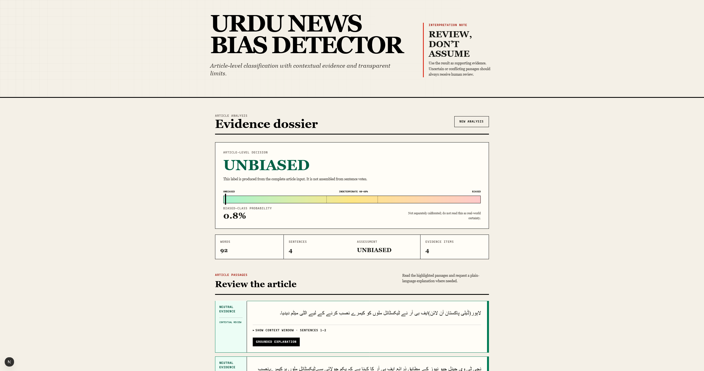
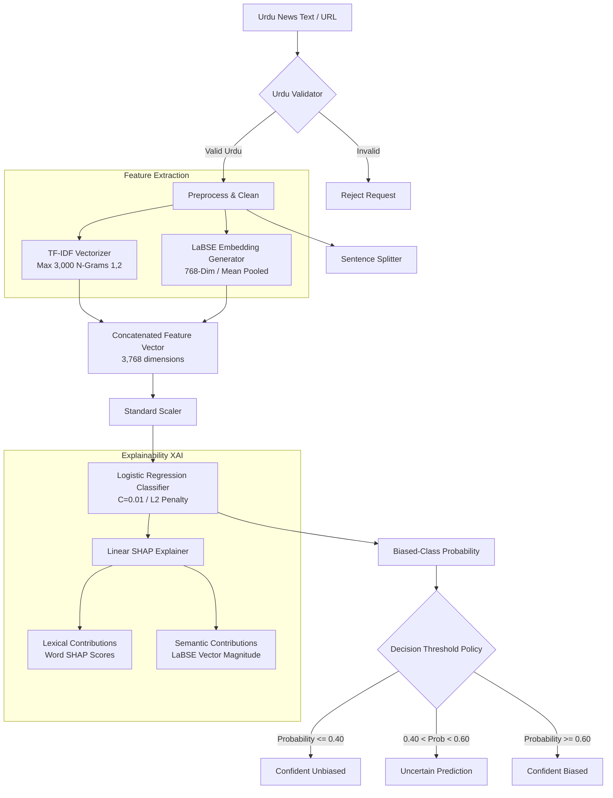

# UNBD — Urdu News Bias Detection System
### *Final Year Research Project & Interactive Explainable AI (XAI) Prototype*

Welcome to **UNBD**, an advanced, hybrid machine learning framework and web application built to detect, visualize, and explain political and editorial bias in Urdu news articles. 

Urdu is a highly morphology-rich, Right-to-Left (RTL) language with limited computational resources. UNBD solves the challenge of bias classification by fusing lexical feature spaces with deep, language-agnostic semantic embeddings, and exposes a production-ready, interactive interface for journalists, researchers, and editors.

---

## Application Screenshots

### 1. Main Dashboard
*Interactive bilingual workspace supporting raw Urdu text inputs and public news URL scraping.*


### 2. Explainable AI & Sentence-Level Heatmap
*Highlights biased and unbiased sentences by checking context-window agreement, reducing visual noise.*


### 3. LLM Explanations & Neutral Journalistic Rewrites
*One-click natural Urdu linguistic explanations of flagged sentences and neutral edits powered by DeepSeek-V4.*


*Visualizing unbiased sentence profiles, lexical keywords, and aggregate semantic signal strength:*


---

## Key Features

*   **Hybrid Feature Fusion:** Combines lexical tokens (unigrams/bigrams) with sentence-level deep semantic representation (LaBSE) to capture both explicit propaganda words and structural biases.
*   **Explainable AI (XAI):** Built-in local feature explanation using Linear SHAP (`shap.LinearExplainer`), decomposing predictions into individual word contributions and semantic vector magnitudes.
*   **Granular Sentence-Level Heatmap:** Aggregates word-level SHAP values to score and highlight sentence blocks. Identifies the **Top 5 Biased** and **Top 5 Unbiased** sentences in long articles.
*   **LLM Linguistic Commentary (DeepSeek-V4):** One-click, natural Urdu editorial explanations highlighting why a specific sentence is biased, along with automatic neutral journalistic rewrites while preserving facts.
*   **Input Robustness & Uncertainty Policy:** Displays real-time warnings for out-of-distribution text lengths, low lexical coverage (<35%), or conflicting regional biases across the article, flagging predictions in a 0.40–0.60 "indeterminate band" as uncertain.
*   **Bilingual & Localized UI:** Beautiful, responsive Next.js application supporting Urdu (RTL) and English layouts, styled with custom Urdu typography (Noto Nastaliq Urdu).
*   **Safe Scraper:** Built-in public URL text extraction with private network and loopback IP blocking to prevent Server-Side Request Forgery (SSRF).

---

## Architecture and Model Design

The system implements **Pipeline I**, a deterministic, hybrid classification workflow:



### 1. Feature Representation
*   **Lexical Layer:** A [TfidfVectorizer](https://scikit-learn.org/stable/modules/generated/sklearn.feature_extraction.text.TfidfVectorizer.html) fitted to 3,000 max features with an n-gram range of `(1, 2)`. This captures key propaganda keywords, emotional modifiers, and biased terminology (e.g., specific political phrases).
*   **Semantic Layer:** Google's Language-Agnostic BERT Sentence Embeddings ([LaBSE](https://huggingface.co/sentence-transformers/LaBSE)). It converts text into a 768-dimensional dense vector using attention-mask-mean pooling across the token outputs, with a max sequence length of 128 tokens. This captures grammatical construct bias, passive-aggressive framing, and context-dependent sarcasm independent of specific vocabulary.

### 2. Classification
*   The concatenated vector (3,768 features) passes through a fitted [StandardScaler](https://scikit-learn.org/stable/modules/generated/sklearn.preprocessing.StandardScaler.html) and a [LogisticRegression](https://scikit-learn.org/stable/modules/generated/sklearn.linear_model.LogisticRegression.html) model (L2 penalty, regularization $C=0.01$, and solver `lbfgs`).
*   Instead of a simple binary prediction, the decision policy evaluates:
    *   **$\le 0.40$**: Confident Unbiased
    *   **$0.40 - 0.60$**: Uncertain (reported as indeterminate/uncertain)
    *   **$\ge 0.60$**: Confident Biased

### 3. Local Explainability (SHAP & LLM)
*   **SHAP Decomposition:** The predictor.py script runs Linear SHAP against the standard model coefficients. It splits the contribution of the features into Lexical SHAP (first 3,000 indices) and Semantic SHAP (last 768 indices).
*   **Sentence-Level Context Probe:** An exploratory sequence evaluator slices the article into sentence context windows (sentence + 1 leading + 1 trailing sentence). It evaluates local probabilities and SHAP features relative to the surrounding block.
*   **LLM Verification:** The llm_service.py script utilizes a custom-prompted DeepSeek-V4 chat instance to rewrite biased text and describe linguistic bias strictly in Urdu without mentioning ML parameters or internal scores.

---

## Evaluation and Validation Metrics

The current production artifacts are evaluated using **Nested Stratified Cross-Validation** (5 Outer Folds, 3 Inner Folds) to prevent hyperparameter optimism and dataset leakage.

| Metric | Measured Value |
| :--- | :--- |
| **Dataset Size** | 10,000 Urdu News Articles |
| **Evaluation Unit** | Article-level decision |
| **Out-of-Fold Accuracy** | **80.25%** |
| **Macro Average F1** | **0.8022** |
| **Biased Class Precision / Recall** | 0.800 / 0.789 |
| **Unbiased Class Precision / Recall** | 0.805 / 0.815 |


---

## Project Structure

Below is the directory mapping for the workspace:

```bash
UNBDapp/
├── Datasets/                       # Folder containing experimental data files
├── Pipelines/                      # Pipeline notebooks and training logs
├── backend/                        # FastAPI Backend Application
│   ├── model/                      # Serialized training artifacts (scikit-learn models)
│   │   ├── lr_model.pkl            # Trained Logistic Regression classifier
│   │   ├── scaler.pkl              # StandardScaler checkpoint
│   │   ├── tfidf_vectorizer.pkl    # Fitted TF-IDF Vectorizer
│   │   ├── x_background.npy        # SHAP background distribution dataset
│   │   └── model_metadata.json     # Model hyperparams & metrics metadata
│   ├── services/                   # Business and Prediction Services
│   │   ├── predictor.py            # Local model loading, SHAP & sentence analyzer
│   │   ├── llm_service.py          # DeepSeek LLM explain/rewrite integration
│   │   ├── url_extractor.py        # Safe public webpage paragraph scraper
│   │   └── validator.py            # Unicode Urdu validation utility
│   ├── app.py                      # FastAPI endpoint configuration and CORS setup
│   └── requirements.txt            # Python backend dependencies
├── frontend/                       # Next.js Frontend Application
│   ├── src/app/
│   │   ├── globals.css             # Main styling system, themes, and font loaders
│   │   ├── layout.tsx              # Root HTML wrapper and Next Font setups
│   │   └── page.tsx                # Dynamic, bilingual interactive dashboard
│   ├── package.json                # Node frontend dependencies
│   ├── tailwind.config.ts          # Tailwind styling definitions
│   └── tsconfig.json               # TypeScript configurations
├── train_final_model.py            # Re-evaluation and model training builder script
├── devlog.md                       # Log of features, adjustments, and modifications
├── GEMINI.md                       # High-level architecture instruction checklist
└── urdu-bias-scrollytelling-single.html # Interactive scrollytelling learning walkthrough
```

---

## Local Setup and Configuration

### Backend Setup

1. Navigate to the backend directory and set up a Python virtual environment:
   ```bash
   cd backend
   python -m venv venv
   # On Windows (PowerShell):
   .\venv\Scripts\Activate.ps1
   # On macOS/Linux:
   source venv/bin/activate
   ```
2. Install Python packages:
   ```bash
   pip install -r requirements.txt
   ```
3. Create a `.env` file in the backend/ folder (or duplicate backend/.env.example):
   ```env
   DEEPSEEK_API_KEY=your-api-key-here
   FRONTEND_ORIGINS=http://localhost:3000,http://127.0.0.1:3000
   ```
   *(Note: DeepSeek is optional; if missing, the UI fallback will show a friendly explanation that the API key is not configured).*
4. Run the FastAPI development server:
   ```bash
   python app.py
   ```
   The backend will be available at http://localhost:8000.

### Frontend Setup

1. Navigate to the frontend directory:
   ```bash
   cd ../frontend
   ```
2. Install Node packages:
   ```bash
   npm install
   ```
3. Set up environment variables in frontend/.env.local:
   ```env
   NEXT_PUBLIC_API_URL=http://localhost:8000
   ```
4. Start the Next.js development server:
   ```bash
   npm run dev
   ```
   Open http://localhost:3000 in your browser to interact with the application.

---

## Model Training and Re-Evaluation

If you modify the training dataset (training_final_dataset.csv) or want to rebuild/re-evaluate the Pipeline I model artifacts, execute the final model builder script at the workspace root:

```bash
python train_final_model.py --force
```

This script will:
1. Re-generate deterministic LaBSE embeddings using your GPU (if CUDA is available) or CPU.
2. Run a full 5x3 Nested Stratified Cross-Validation to recompute prediction accuracy and F1 metrics.
3. Serialize the vectorizer, scaler, model, and SHAP background distributions to backend/model/.
4. Update the model_metadata.json metadata metrics used at runtime.

---

## Interactive Walkthrough (Scrollytelling)

For non-technical stakeholders or reviewers, this repository includes an interactive walkthrough page: urdu-bias-scrollytelling-single.html. 

This self-contained HTML page uses interactive scroll-based animations to explain:
*   How Urdu news articles are tokenized.
*   How TF-IDF and LaBSE features capture local biases.
*   How SHAP explains model decisions.
*   How the user dashboard facilitates neutral rewriting.

To view it, simply open the file in any modern web browser.
